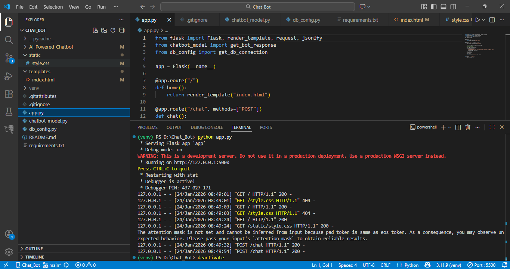
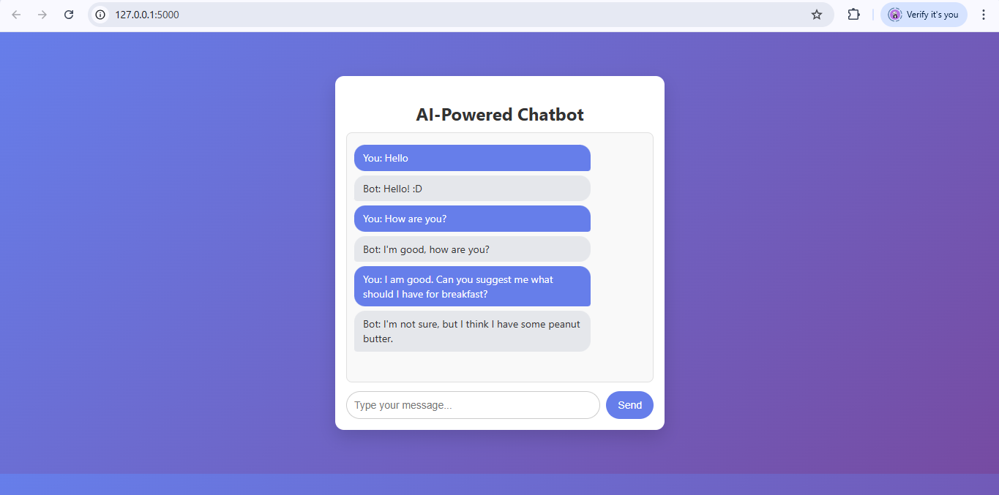

# AI-Powered Chatbot
An intelligent chatbot built using Transformer-based NLP models capable of generating contextual responses and storing chat history in MySQL.

## AI-Powered Chatbot Using NLP

An intelligent chatbot built using Transformer-based NLP models to generate contextual responses and store conversation logs in MySQL.

## Technologies Used
- Python
- Flask
- Hugging Face Transformers
- MySQL
- HTML & CSS

## Features
- Context-aware conversational AI
- Real-time responses
- Chat history stored in MySQL
- Clean UI

## How to Run
1. Install dependencies  
   `pip install -r requirements.txt`
2. Create MySQL database and table
3. Update DB credentials
4. Run  
   `python app.py`

## Future Improvements
- User authentication
- Admin dashboard
- Analytics
